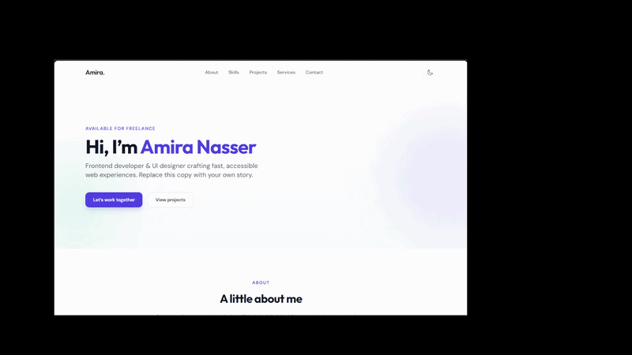
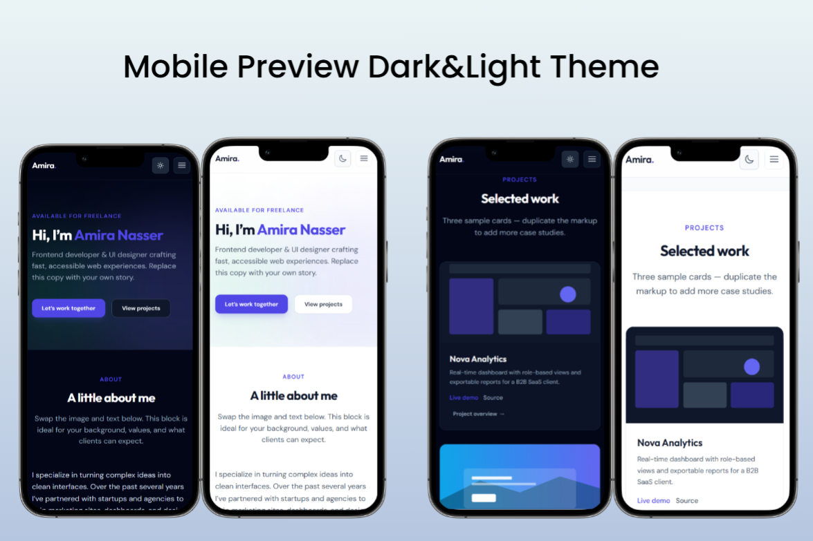
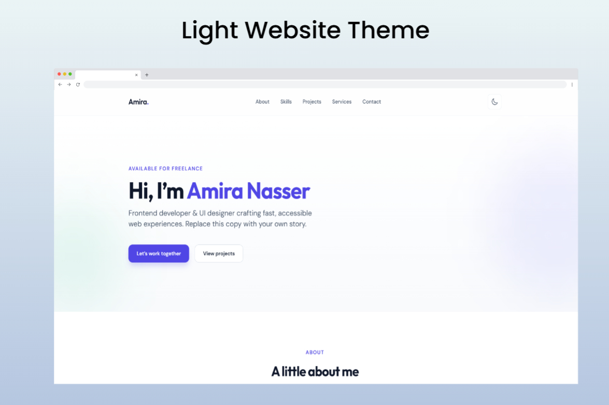
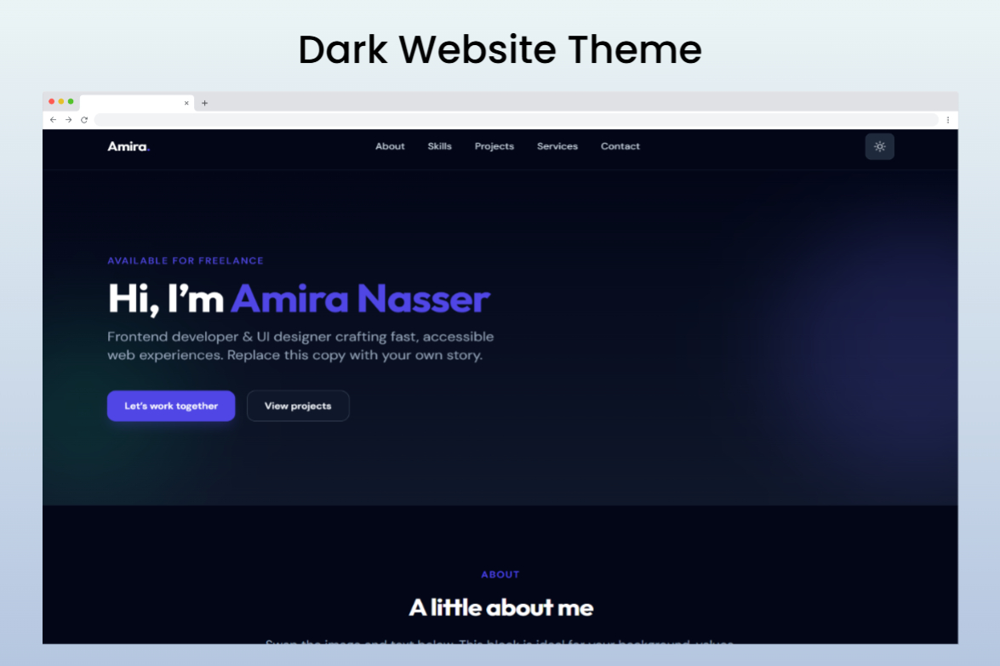

# Amira Nasser Portfolio

A modern, responsive personal portfolio template designed for frontend developers and UI designers. Built with clean HTML, Tailwind CSS, and vanilla JavaScript, this template showcases your work with smooth animations, dark mode support, and accessibility features.

## Demo

 <!-- Replace with your actual demo GIF -->




## Features

- **Responsive Design**: Optimized for all devices with mobile-first approach
- **Dark Mode**: Toggle between light and dark themes
- **Smooth Animations**: CSS animations and JavaScript-powered motion effects
- **Accessibility**: WCAG-compliant with proper ARIA labels and keyboard navigation
- **Project Showcase**: Interactive project cards with modal details
- **Contact Form**: Client-side validation with success feedback
- **Customizable**: Easy to adapt with your own content and branding

## Technologies Used

- **HTML5**: Semantic markup for better SEO and accessibility
- **Tailwind CSS**: Utility-first CSS framework for rapid styling
- **JavaScript (ES6+)**: Vanilla JS for interactivity and DOM manipulation
- **Fonts**: Google Fonts (DM Sans and Outfit) for typography


## Getting Started

1. Clone the repository:
   ```bash
   git clone https://github.com/yourusername/portfolio.git
   cd portfolio
   ```

2. Open `index.html` in your browser to view the site.

3. Customize the content:
   - Update personal information in `index.html`
   - Replace placeholder images in `assets/` folder
   - Modify styles in `css/style.css` and `css/animations.css`
   - Adjust Tailwind config in `js/tailwind-config.js`

## Project Structure

```
portfolio/
├── index.html          # Main HTML file
├── README.md           # This file
├── assets/             # Images and icons
├── css/
│   ├── style.css       # Main styles
│   └── animations.css  # Animation styles
└── js/
    ├── main.js         # Main JavaScript
    ├── motion.js       # Animation logic
    ├── dialog.js       # Modal functionality
    └── tailwind-config.js # Tailwind configuration
```

## Customization

- **Colors**: Update Tailwind config for brand colors
- **Content**: Edit sections in `index.html`
- **Images**: Replace SVG placeholders with your photos
- **Links**: Update social media and project links

## Browser Support

- Chrome (latest)
- Firefox (latest)
- Safari (latest)
- Edge (latest)

## License

This project is open source and available under the [MIT License](LICENSE).

## Contact

Amira Nasser - [hello@example.com](mailto:hello@example.com)

Project Link: [https://github.com/yourusername/portfolio](https://github.com/yourusername/portfolio)